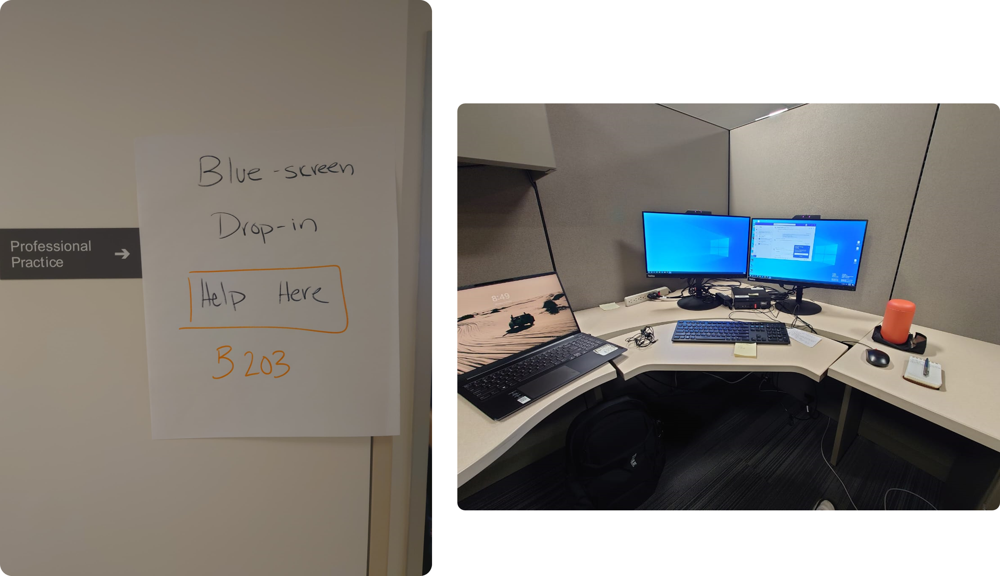
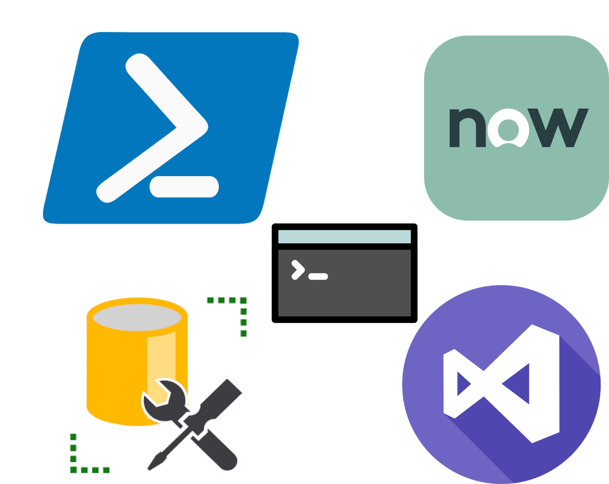

<!--  

 ```PowerShell
PS C:\Users\Abdulqadir Abuharrus> info.ps1
- "I'm Abdo"
- "System Analyst Co-op on the CATS team!"
- "From BCIT's CST program."
``` -->


<div class='flex-container'>
    <div class='item'>
        
    </div>
    <div class='item'>
    <h1>Quick Refresher</h1>
     <pre class='code-block'><span style="color:orange;">PS</span> C:\Users\AbdulqadirAbuharrus> .\info.ps1</pre>
        <pre>
- "I'm Abdo"
- "System Analyst Co-op on the CATS team!"
- "From BCIT's CST program."
        </pre>
    </div>
</div>

---
# What I've worked on
<div class="flex-container">
<div class="item">
    <ul>
    <li><p>
        <p>Written over 13 programs & scripts, including one for DocAlPrt<br> and a ticket scraper for ServiceNow.</p>
    </p></li>
    <li><p>
        Generated many CAIS reports from SQL queries and scripts</>
    </p></li>
    <li><p>
        <p>Updated legacy scripts for new Active Directory policies</p>
    </p></li>
    <li><p>
        <p>CAIS user provisioning, 600+ tickets</p>
    </p></li>
    <li><p>
        <p>Wrote documentation and guides for future co-ops</p>
    </p></li>
    </ul>
</div>
<div class='item'>
    
    <p class="caption">Left: Fixing BSODs at VGH Jul 22nd, 2024; Right: second week at the office.</p>
</div>
</div>

---
# What I've learned
<div class="flex-container">
<div class="item">
    <ul>
        <li><p>PowerShell scripting</p></li>
        <li><p>Active Directory and user management</p></li>
        <li><p>Improved my SQL skills (much to be improved...)</p></li>
        <li><p>Maintainig productivity in WFH setting.</p></li>
        <li><p>Getting into the habit of documenting my work.</p></li>
    </ul>
    </div>
    <div class="item">
        
            <p class="caption">My toolset.</p>
    </div>
    
</div>

---
# Highlights
<ul>
<li><p>Our little in-person Monday huddles.</p></li>
<li><p>Very talented team members who are always keen on helping and teaching.</p></li>
<li><p>BBQ at Tanico's, the 🍔 were 10/10!</p></li>
</ul>

---
# Suggestions
<ul>
<li><p>Give co-ops a chance to lead a mini-project, perhaps?</p></li>
<li><p>Ask co-ops to write down their goals and what skills they'd like to develop early on, <br> it helps keep them motivated and set goals to work towards. <em>#get_good</em></p></li>
</ul>
</div>

---

<div>
    <h1><span style="color: #ffff; font-size: 6rem">Goodbye :(</span></h1>
    <p>It was great, so thank you.</p>
</div>
