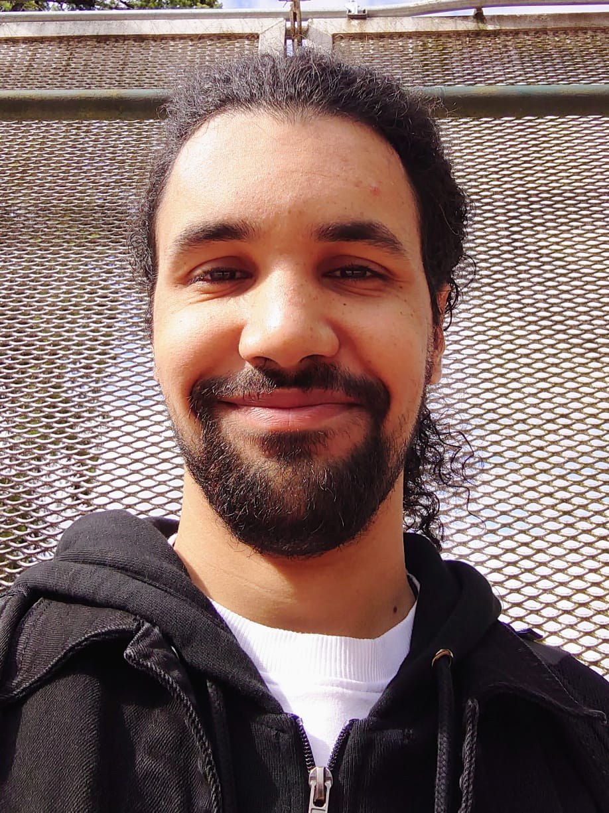

### Quick Refresher
* I'm Abdo!
* System Analyst Co-op on the *CATS* team!
* From BCIT's CST program
* 
---
### What I worked on

<ul>
<li>
    
Wrote over 13 programs & scripts, including one for DocAlPrt

</li>
<li>
    
Generated many CAIS reports from SQL queries and scripts

</li>
<li>
    
Updated legacy scripts for new Active Directory policies

</li>
<li>
    
CAIS user provisioning

</li>
<li>
    
Wrote documentation and guides for future co-ops

</li>
<!-- <li>
    <small></small>
</li> -->
</ul>

---
### Growth

<ul>
<li>PowerShell scripting</li>
<li>Active Directory and user management</li>
<li>Improved my SQL skills (much to be improved...)</li>
<li>Maintainig productivity in WFH settting.</li>
<li>Getting into habit of documenting my work.</li>
</ul>

---
### Highlights
<ul>
<li>Our little in-person Monday huddles.</li>
<li>Very talented team members that are always keen on helping and teaching.</li>
<li>Tanico's cheeseburgers, seriously. 10/10 Can't recommend enough.</li>
</ul>

---
### Suggestions _(nitpicking tbh)_

<ul>
<li>Give co-ops a chance to lead a mini project.</li>
<li>Ask co-ops to write out their goals in their role early on, helps keep them motivated.</li>
</ul>

---

    <h1>:(</h1>
    <h2>Goodbye</h2>
    
It was great, thank you.

